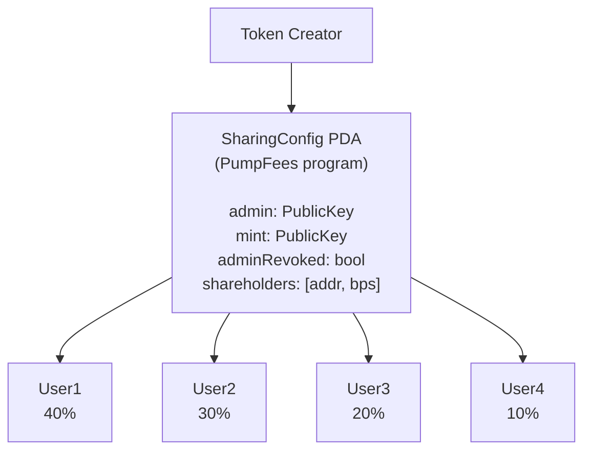
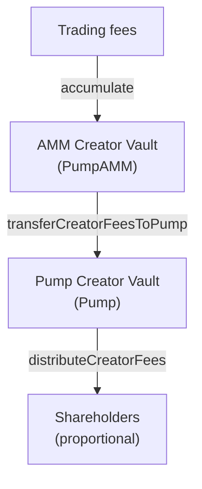

# Fee Sharing — Multi-Party Creator Fee Distribution

## Skill Description

Configure and manage creator fee sharing — allowing token creators to distribute accumulated trading fees to multiple shareholders using the PumpFees program with BPS-based share allocation, admin management, and cross-program fee consolidation for graduated tokens.

## Context

Pump charges trading fees split between protocol and creator. The Fee Sharing system lets creators distribute their portion to up to 10 shareholders proportionally. It works across both the bonding curve (Pump program) and graduated AMM (PumpAMM program). The system is managed through the PumpFees program (`pfeeUxB6jkeY1Hxd7CsFCAjcbHA9rWtchMGdZ6VojVZ`).

## Key Files

- `src/sdk.ts` — `createFeeSharingConfig`, `updateFeeShares`, `distributeCreatorFees`, `getMinimumDistributableFee`
- `src/onlineSdk.ts` — `buildDistributeCreatorFeesInstructions`, `getMinimumDistributableFee`, `collectCoinCreatorFeeInstructions`
- `src/errors.ts` — shareholder validation error classes
- `src/state.ts` — `SharingConfig`, `Shareholder`, `DistributeCreatorFeesEvent`, `MinimumDistributableFeeEvent`
- `src/pda.ts` — `feeSharingConfigPda(mint)`, `creatorVaultPda(creator)`, `ammCreatorVaultPda(creator)`
- `src/idl/pump_fees.ts` — PumpFees program IDL

## Architecture



## Workflow

### 1. Create Fee Sharing Config

```typescript
const ix = PUMP_SDK.createFeeSharingConfig({
    creator,     // token creator's PublicKey
    mint,        // token mint address
    pool?,       // AMM pool pubkey (required for graduated tokens)
    payer,       // transaction fee payer
    shareholders: [
        { address: userA, shareBps: 5000 },  // 50%
        { address: userB, shareBps: 3000 },  // 30%
        { address: userC, shareBps: 2000 },  // 20%
    ]
});
```

- Creates a `SharingConfig` PDA for the mint via the PumpFees program
- If token is graduated, pass `pool` (AMM pool pubkey)
- The bonding curve's creator field gets pointed to the SharingConfig PDA

### 2. Update Shareholders

```typescript
const ix = PUMP_SDK.updateFeeShares({
    creator,      // admin PublicKey
    mint,         // token mint
    shareholders: [
        { address: userA, shareBps: 4000 },  // 40%
        { address: userB, shareBps: 3000 },  // 30%
        { address: userD, shareBps: 3000 },  // 30% (replaced userC)
    ]
});
```

**Validation performed before building instruction:**
- At least 1 shareholder
- Maximum 10 shareholders
- No zero-share entries (`shareBps > 0`)
- Shares sum to exactly 10,000 BPS
- No duplicate addresses
- Throws typed errors if validation fails

### 3. Check Distributable Fees

```typescript
const result = await onlineSdk.getMinimumDistributableFee(mint);

console.log("Minimum required:", result.minimumRequired.toString());
console.log("Distributable fees:", result.distributableFees.toString());
console.log("Can distribute:", result.canDistribute);
console.log("Is graduated:", result.isGraduated);
```

This method uses **transaction simulation** to compute the values on-chain — it cannot be computed offline.

### 4. Distribute Fees

```typescript
const { instructions, isGraduated } = await onlineSdk.buildDistributeCreatorFeesInstructions(mint);

// For graduated tokens, instructions contain:
// 1. transferCreatorFeesToPump — consolidates AMM vault → Pump vault
// 2. distributeCreatorFees — distributes Pump vault → shareholders

// For non-graduated tokens:
// 1. distributeCreatorFees only

const tx = new Transaction().add(...instructions);
```

### 5. Check Migration Status

```typescript
const isSharingEnabled = isCreatorUsingSharingConfig({ mint, creator });
// Returns true if the bonding curve's creator PDA equals the SharingConfig PDA
```

## State Types

```typescript
interface SharingConfig {
    version: number;
    mint: PublicKey;
    admin: PublicKey;
    adminRevoked: boolean;     // If true, shareholders cannot be changed
    shareholders: Shareholder[];
}

interface Shareholder {
    address: PublicKey;
    shareBps: number;  // Basis points (1 = 0.01%, 100 = 1%, 10000 = 100%)
}

interface DistributeCreatorFeesEvent {
    timestamp: BN;
    mint: PublicKey;
    sharingConfig: PublicKey;
    admin: PublicKey;
    shareholders: Shareholder[];
    distributed: BN;           // Total SOL distributed in lamports
}

interface MinimumDistributableFeeEvent {
    minimumRequired: BN;
    distributableFees: BN;
    canDistribute: boolean;
}
```

## Validation Rules & Error Classes

| Rule | Error Class | Message |
|------|------------|---------|
| At least 1 shareholder | `NoShareholdersError` | "Shareholders array is empty" |
| Maximum 10 shareholders | `TooManyShareholdersError(count, max)` | "Too many shareholders: {count} > {max}" |
| No zero-share entries | `ZeroShareError(address)` | "Shareholder {address} has zero share" |
| Shares sum to 10,000 BPS | `InvalidShareTotalError(total)` | "Share total {total} ≠ 10000" |
| No duplicate addresses | `DuplicateShareholderError` | "Duplicate shareholder addresses" |
| Graduated tokens need pool | `PoolRequiredForGraduatedError` | "Pool required for graduated token" |

## Cross-Program Fee Consolidation

For graduated tokens, fees accumulate in two separate vaults:



The `buildDistributeCreatorFeesInstructions` method automatically detects graduation and includes the consolidation step.

## Direct Fee Collection (Without Sharing)

Creators who haven't opted into fee sharing can collect directly:

```typescript
// Collect from both vaults
const ixs = await onlineSdk.collectCoinCreatorFeeInstructions(creator);

// Check balance across both programs
const balance = await onlineSdk.getCreatorVaultBalanceBothPrograms(creator);
// Returns balance (total lamports - rent exemption)
```

## Patterns to Follow

- Validate shareholder arrays before sending: max 10, sum = 10,000 BPS, no duplicates, no zero shares
- Use `BothPrograms` methods when aggregating across Pump + PumpAMM
- Always check `isGraduated` to determine if AMM fee consolidation is needed
- Use typed error classes from `src/errors.ts` for validation failures
- Use transaction simulation for `getMinimumDistributableFee` — values are computed on-chain
- Check `adminRevoked` before attempting to update shareholders
- Use `isCreatorUsingSharingConfig` to detect if a creator has migrated to fee sharing

## Common Pitfalls

- Shares must total exactly 10,000 BPS (100%) — not 100, not 1,000,000
- Graduated tokens require the `pool` parameter for config creation
- `distributeCreatorFees` will fail if `canDistribute === false` (below minimum threshold)
- Two separate creator vaults exist: `creatorVaultPda` (Pump, `"creator-vault"`) and `ammCreatorVaultPda` (PumpAMM, `"creator_vault"`)
- `updateFeeShares` will fail on-chain if `adminRevoked === true`
- `getMinimumDistributableFee` requires a simulation signer — any valid PublicKey works (doesn't actually sign)
- Basis points use integer arithmetic — you cannot have fractional bps (33.33% must be 3333 bps, with 1 bps allocated elsewhere)
- `feeSharingConfigPda` is per-mint — each token has its own sharing config

