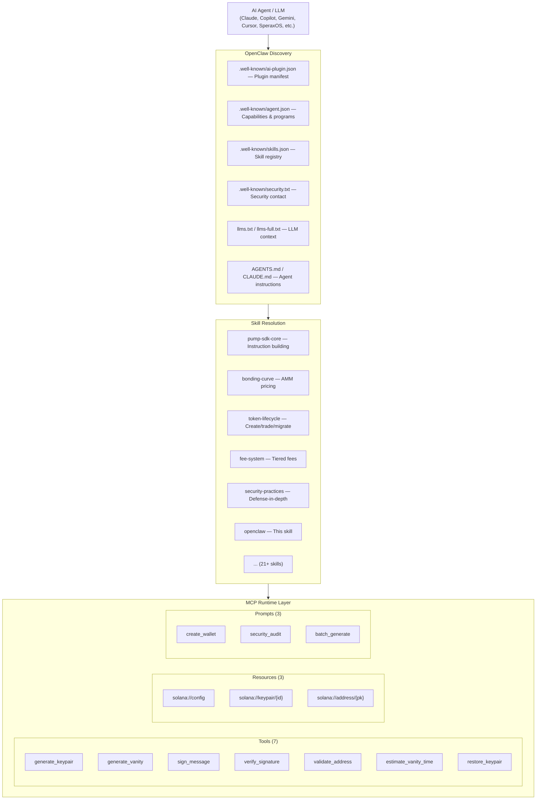

# OpenClaw — AI Agent Skill Packaging & Discovery

## Skill Description

Design, package, and deploy OpenClaw-compatible skill packages for the Pump SDK — the open standard for building AI agent plugins that Claude, MCP clients, and SperaxOS agent teams can autonomously discover, load, and execute on the Solana blockchain.

## Context

OpenClaw is the open-source standard for building AI agent plugins and skills. It defines a format — compatible with Claude's tool-use architecture — for packaging capabilities that AI agents can discover, load, and execute. Think of it as the app store architecture for AI agents: instead of apps, you have **skills**; instead of APIs, you have **tool definitions**; instead of manual integration, agents can **autonomously discover** and use new capabilities.

The Pump SDK is designed to work within this ecosystem. The MCP server is an OpenClaw-compatible skill that gives any Claude-powered agent (or any MCP-compatible agent) the ability to generate wallets, manage keys, interact with Pumpfun, and operate autonomously. The `skills.json` registry, `.well-known/` manifests, and skill files form the discoverable surface that agents use to understand and invoke SDK capabilities.

## Key Files

### Discovery & Registration

- [.well-known/ai-plugin.json](.well-known/ai-plugin.json) — AI plugin manifest (OpenAI-compatible discovery)
- [.well-known/agent.json](.well-known/agent.json) — Agent capabilities, programs, security config
- [.well-known/skills.json](.well-known/skills.json) — Skills registry with paths, tags, and metadata
- [.well-known/security.txt](.well-known/security.txt) — Security contact (RFC 9116)
- [server.json](server.json) — MCP server manifest (package registration)

### Context Files

- [llms.txt](llms.txt) — Quick reference for LLMs (~2KB architecture overview)
- [llms-full.txt](llms-full.txt) — Comprehensive LLM context (~15KB all programs, PDAs, types)

### Agent Instruction Files

- [AGENTS.md](AGENTS.md) — Universal agent guidelines
- [CLAUDE.md](CLAUDE.md) — Claude-specific instructions
- [GEMINI.md](GEMINI.md) — Gemini-specific instructions
- [.github/copilot-instructions.md](.github/copilot-instructions.md) — GitHub Copilot instructions

### MCP Server (Skill Runtime)

- [mcp-server/src/server.ts](mcp-server/src/server.ts) — `SolanaWalletMCPServer` lifecycle and capabilities
- [mcp-server/src/tools/index.ts](mcp-server/src/tools/index.ts) — 7 tool implementations
- [mcp-server/src/resources/](mcp-server/src/resources/) — 3 resource URI types
- [mcp-server/src/prompts/index.ts](mcp-server/src/prompts/index.ts) — 3 guided workflow prompts

### Skill Files

- [.github/skills/](/.github/skills/) — All `.skill.md` domain documents (21+)

## Architecture



## OpenClaw Skill Package Format

An OpenClaw skill package is a self-contained unit that an AI agent can discover and consume. It consists of three layers:

### Layer 1: Discovery Manifests

The `.well-known/` directory provides machine-readable entry points:

```json
// .well-known/ai-plugin.json — Plugin identity
{
  "schema_version": "v1",
  "name_for_human": "Pump SDK",
  "name_for_model": "pump_sdk",
  "description_for_human": "Official community PumpFun SDK...",
  "description_for_model": "Pump SDK (@pump-fun/pump-sdk) — TypeScript SDK for..."
}

// .well-known/skills.json — Skill registry
{
  "schema_version": "v1",
  "skills": [
    {
      "id": "pump-sdk-core",
      "name": "Pump SDK Core — Instruction Building",
      "description": "Build TransactionInstructions for...",
      "path": ".github/skills/pump-sdk-core.skill.md",
      "tags": ["typescript", "solana", "sdk"]
    }
  ]
}

// .well-known/agent.json — Capabilities
{
  "schema_version": "v1",
  "capabilities": {
    "code_generation": true,
    "code_review": true,
    "debugging": true,
    "testing": true,
    "documentation": true,
    "refactoring": true
  },
  "security": {
    "official_libraries_only": true,
    "memory_zeroization": true,
    "offline_capable": true
  }
}
```

### Layer 2: Context Documents

LLM context files provide quick and deep reference:

| File | Audience | Size Target | Content |
|------|----------|-------------|---------|
| `llms.txt` | Quick load | < 3KB | Architecture overview, key patterns |
| `llms-full.txt` | Deep dive | < 20KB | All programs, PDAs, types, accounts |
| `AGENTS.md` | All agents | ~5KB | Architecture tables, skill index |
| `CLAUDE.md` | Claude | ~2KB | Key directories, critical patterns |

### Layer 3: Skill Documents

Each `.skill.md` file provides deep domain knowledge in a consistent format:

```markdown
# {Title} — {Subtitle}

## Skill Description
One-paragraph scope definition.

## Context
Architectural context and motivation.

## Key Files
- [path/to/file](path/to/file) — Description

## {Domain Sections}
Types, formulas, architecture, code examples...

## Patterns to Follow
- Best practices as bullet points

## Common Pitfalls
- Anti-patterns and mistakes
```

## Creating a New OpenClaw Skill Package

### Step 1: Write the Skill Document

Create `.github/skills/{domain}.skill.md` following the standard format. Include:
- Concrete code examples from the actual codebase (not pseudo-code)
- Cross-references to related skill files
- TypeScript interfaces and function signatures
- Architecture diagrams where appropriate

### Step 2: Register in skills.json

Add an entry to `.well-known/skills.json`:

```json
{
  "id": "my-new-skill",
  "name": "My New Skill — Descriptive Subtitle",
  "description": "What the skill covers and when to use it.",
  "path": ".github/skills/my-new-skill.skill.md",
  "tags": ["tag1", "tag2", "tag3"]
}
```

Rules:
- `id` must match the filename (without `.skill.md`)
- `path` is relative to repository root
- `tags` are lowercase, 3-6 per skill, covering language + domain
- `name` follows the format `Title — Subtitle`

### Step 3: Update Context Documents

1. **llms.txt** — Add a one-liner about the new capability
2. **llms-full.txt** — Add a detailed section if the feature is significant
3. **AGENTS.md / CLAUDE.md / GEMINI.md** — Add relevant context to agent instruction files

### Step 4: Wire MCP Tools (if applicable)

If the skill exposes operations to agents, implement them as MCP tools:

```typescript
// mcp-server/src/tools/my-tool.ts
import { z } from 'zod';
import { ServerState, ToolResult } from '../types/index.js';

const MyToolSchema = z.object({
  param: z.string().describe('Description for the AI agent'),
});

export async function handleMyTool(
  args: Record<string, unknown>,
  state: ServerState
): Promise<ToolResult> {
  const parsed = MyToolSchema.safeParse(args);
  if (!parsed.success) {
    return {
      content: [{ type: 'text', text: `Invalid arguments: ${parsed.error.message}` }],
      isError: true,
    };
  }

  // Implementation using official Solana Labs libraries only
  return {
    content: [{ type: 'text', text: JSON.stringify(result) }],
    isError: false,
  };
}
```

Register the tool in the handler dispatch:

```typescript
// mcp-server/src/tools/index.ts
case 'my_new_tool':
  return handleMyTool(args, state);
```

### Step 5: Add MCP Resources (if applicable)

Expose queryable state via `solana://` URI resources:

```typescript
// URI pattern: solana://my-resource/{param}
{
  uri: `solana://my-resource/${id}`,
  name: 'My Resource',
  description: 'Description for agent discovery',
  mimeType: 'application/json',
}
```

### Step 6: Add MCP Prompts (if applicable)

Create guided workflows for multi-step operations:

```typescript
{
  name: 'my_workflow',
  description: 'Guided workflow for...',
  arguments: [
    { name: 'type', description: 'Workflow variant', required: false }
  ],
}
```

## MCP as the OpenClaw Runtime

The MCP server is the execution layer for OpenClaw skills. The mapping:

| OpenClaw Concept | MCP Implementation | Pump SDK Example |
|------------------|-------------------|------------------|
| Skill capability | Tool | `generate_keypair`, `sign_message` |
| Skill state | Resource | `solana://keypair/{id}`, `solana://config` |
| Skill workflow | Prompt | `create_wallet`, `security_audit` |
| Skill discovery | `server.json` manifest | npm package registration |
| Skill transport | stdio (JSON-RPC 2.0) | stdin/stdout with `StdioServerTransport` |
| Skill lifecycle | Server start/shutdown | `SolanaWalletMCPServer` with zeroization |

### Server Manifest (server.json)

The `server.json` file registers the MCP server with package managers:

```json
{
  "name": "io.github.nirholas/solana-wallet-toolkit",
  "version": "0.1.0",
  "packages": [{
    "registryType": "npm",
    "identifier": "solana-wallet-toolkit",
    "runtimeHint": "npx",
    "transport": { "type": "stdio" }
  }]
}
```

### Client Configuration

Agents connect to the skill runtime via MCP client config:

```json
{
  "mcpServers": {
    "solana-wallet": {
      "command": "node",
      "args": ["/path/to/mcp-server/dist/index.js"]
    }
  }
}
```

## SperaxOS Integration

SperaxOS is an AI-powered DeFi operating system that uses agent teams with coordinators. The Pump SDK integrates as a native SperaxOS skill following the OpenClaw format:

- **Agent teams** can manage Pumpfun tokens collaboratively
- **Fee claiming** becomes a natural language command: *"Claim my creator fees"*
- **Fee distribution** to shareholders happens automatically
- **Portfolio management** across bonding curve and graduated (AMM) tokens is unified
- **Voice commands** via TTS can trigger on-chain operations

The integration is plug-and-play for any SperaxOS agent team because it follows the OpenClaw/Claude format.

## Agent Autonomous Workflow Example

An agent with access to the Pump SDK OpenClaw skill can execute complex workflows:

```
User: "Generate a vanity address starting with 'PUMP' and create a new token with it"

Agent workflow:
1. Discover skill via .well-known/skills.json
2. Load pump-sdk-core + solana-wallet skills
3. Call MCP tool: estimate_vanity_time(prefix: "PUMP")
4. Call MCP tool: generate_vanity(prefix: "PUMP", timeout: 120)
5. Save keypair: generate_vanity(prefix: "PUMP", saveId: "mint-key")
6. Read MCP resource: solana://keypair/mint-key
7. Build createV2Instruction using core SDK
8. Return transaction for user signing
```

## Security Model

OpenClaw skills in the Pump SDK enforce strict security invariants:

1. **Official libraries only** — `solana-sdk`, `@solana/web3.js`, `solana-keygen`
2. **Memory zeroization** — All `Uint8Array` secret keys zeroed on shutdown
3. **No network for keys** — Key generation is always offline
4. **stdout isolation** — Tool output on stdout only; logging to stderr
5. **Input validation** — Zod schemas validate all tool arguments
6. **Permission model** — Keypair file permissions set to `0600`
7. **No seed phrase recovery** — Deliberately not implemented; defers to Solana CLI

```typescript
// Shutdown zeroization in SolanaWalletMCPServer
async shutdown(): Promise<void> {
  for (const [, keypair] of this.state.generatedKeypairs) {
    keypair.secretKey.fill(0);  // Zeroize secret key material
  }
  this.state.generatedKeypairs.clear();
}
```

## Patterns to Follow

- Keep the discovery layer (`ai-plugin.json`, `agent.json`, `skills.json`) in sync with actual capabilities
- Every MCP tool must validate input with Zod schemas before processing
- Return `{ isError: true }` with descriptive messages on validation failures
- Use `text` content type for all tool results (JSON-formatted strings)
- Log to stderr only — stdout is reserved for MCP protocol communication
- Skill files should contain real code examples from the codebase, not pseudo-code
- New skills must be registered in `skills.json` with matching `id` and filename
- Context documents (`llms.txt`, `llms-full.txt`) must be updated when adding major features
- Agent instruction files (`AGENTS.md`, `CLAUDE.md`, etc.) should stay in sync
- Follow the `kebab-case.skill.md` naming convention for all skill files
- Tag skills with both language tags and domain tags (3-6 tags per skill)
- Keep `llms.txt` under 3KB for quick context loading
- Keep `llms-full.txt` under 20KB — comprehensive but not exhaustive

## Common Pitfalls

- Forgetting to register a new skill file in `.well-known/skills.json` — agents can't discover unregistered skills
- Inconsistent information between `llms.txt`, `AGENTS.md`, and individual skill files — leads to agent confusion
- Using relative paths in skill files that don't resolve from the repository root
- stdout contamination in MCP tools — any `console.log` breaks the JSON-RPC protocol
- Not updating `agent.json` capabilities when adding new agent-facing features
- Skill files that are too abstract — always include concrete code samples with real types
- Creating MCP tools without corresponding Zod validation schemas
- Exposing secret keys through MCP resources — resources must only return public data
- Assuming agents will read all skills — keep each skill self-contained with enough context
- Not testing MCP tools with simulated `CallToolRequest` objects before deployment
- Forgetting the `server.json` manifest when publishing to npm — MCP clients need it for discovery
