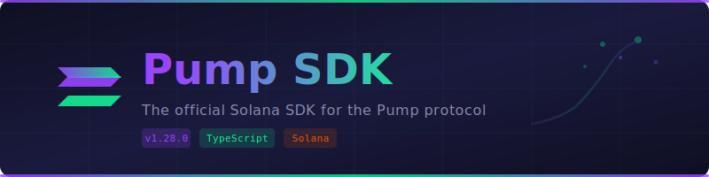
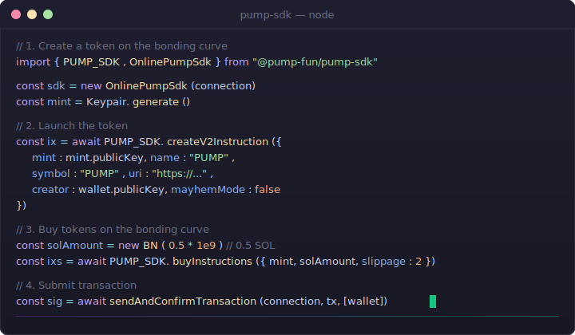

<div align="center">

<pre align="center">
██████╗ ██╗   ██╗███╗   ███╗██████╗     ███████╗██████╗ ██╗  ██╗
██╔══██╗██║   ██║████╗ ████║██╔══██╗    ██╔════╝██╔══██╗██║ ██╔╝
██████╔╝██║   ██║██╔████╔██║██████╔╝    ███████╗██║  ██║█████╔╝ 
██╔═══╝ ██║   ██║██║╚██╔╝██║██╔═══╝     ╚════██║██║  ██║██╔═██╗ 
██║     ╚██████╔╝██║ ╚═╝ ██║██║         ███████║██████╔╝██║  ██╗
╚═╝      ╚═════╝ ╚═╝     ╚═╝╚═╝         ╚══════╝╚═════╝ ╚═╝  ╚═╝
</pre>

<p>
  
</p>

<h3>A community TypeScript SDK for the <a href="https://pump.fun">Pump</a> protocol on Solana</h3>

<p>
Token Creation &nbsp;·&nbsp; Bonding Curves &nbsp;·&nbsp; AMM Pools &nbsp;·&nbsp; Fee Sharing &nbsp;·&nbsp; Volume Rewards<br>
<strong>Create, trade, and graduate tokens — all from TypeScript.</strong>
</p>

<p>
  <a href="https://www.npmjs.com/package/@pump-fun/pump-sdk"></a>&nbsp;
  <a href="https://www.npmjs.com/package/@pump-fun/pump-sdk"></a>&nbsp;
  <a href="LICENSE"></a>&nbsp;
  <a href="https://github.com/pump-fun/pump-sdk"></a>
</p>

<p>
  <a href="https://solana.com"></a>&nbsp;
  <a href="src/"></a>&nbsp;
  <a href="mcp-server/"></a>&nbsp;
  <a href="rust/"></a>
</p>

<br>

[**Docs**](docs/getting-started.md) &nbsp;·&nbsp; [**npm**](https://www.npmjs.com/package/@pump-fun/pump-sdk) &nbsp;·&nbsp; [**API Ref**](docs/api-reference.md) &nbsp;·&nbsp; [**Examples**](docs/examples.md) &nbsp;·&nbsp; [**MCP Server**](mcp-server/)

</div>

---

<div align="center">

### ⚡ See it in action

<picture>
  <source media="(prefers-color-scheme: dark)" srcset=".github/demo.svg">
  <source media="(prefers-color-scheme: light)" srcset=".github/demo.svg">
  
</picture>

</div>

---

### 📖 Table of Contents

- [Why Pump SDK?](#-why-pump-sdk) — What makes it different
- [Quick Start (30 seconds)](#-quick-start) — Copy-paste and go
- [Installation](#-installation) — npm, yarn, or pnpm
- [Token Lifecycle](#-token-lifecycle) — Bonding curve to AMM
- [Usage Examples](#-usage) — Create, buy, sell, fees, rewards
- [Architecture](#-architecture) — Offline & online SDK layers
- [Programs](#-programs) — On-chain program addresses
- [MCP Server](#-mcp-server) — AI agent integration
- [Documentation](#-documentation) — Full guides and references
- [Contributing](#-contributing) — Help make Pump SDK better

---

## 🏆 Why Pump SDK?

<table>
<tr>
<td></td>
<td align="center"><strong>Pump SDK</strong></td>
<td align="center"><strong>Manual RPC</strong></td>
<td align="center"><strong>Generic DEX SDKs</strong></td>
</tr>
<tr><td><strong>Bonding curve math</strong></td><td align="center">✅ Built-in</td><td align="center">❌ DIY</td><td align="center">❌ Not supported</td></tr>
<tr><td><strong>Token graduation</strong></td><td align="center">✅ Automatic</td><td align="center">❌ DIY</td><td align="center">❌ Not supported</td></tr>
<tr><td><strong>Fee sharing</strong></td><td align="center">✅ Up to 10 shareholders</td><td align="center">❌ DIY</td><td align="center">❌ Not supported</td></tr>
<tr><td><strong>Volume rewards</strong></td><td align="center">✅ Track & claim</td><td align="center">❌ DIY</td><td align="center">❌ Not supported</td></tr>
<tr><td><strong>Offline mode</strong></td><td align="center">✅ No connection needed</td><td align="center">❌ Always online</td><td align="center">⚠️ Partial</td></tr>
<tr><td><strong>TypeScript types</strong></td><td align="center">✅ Full IDL types</td><td align="center">❌ None</td><td align="center">⚠️ Partial</td></tr>
<tr><td><strong>MCP server</strong></td><td align="center">✅ AI agent ready</td><td align="center">❌</td><td align="center">❌</td></tr>
<tr><td><strong>3 programs</strong></td><td align="center">✅ Pump + AMM + Fees</td><td align="center">⚠️ Manual</td><td align="center">❌ Not supported</td></tr>
</table>

---

## ✨ Features

<table>
<tr>
<td width="50%">

**🚀 Token Creation**
- Launch tokens on bonding curves with one instruction
- Create + buy atomically in a single transaction
- Mayhem mode for alternate routing

</td>
<td width="50%">

**📈 Trading**
- Buy & sell with configurable slippage protection
- Bonding curve price math built-in
- Automatic graduated token detection

</td>
</tr>
<tr>
<td width="50%">

**💰 Fee System**
- Collect creator fees across both programs
- Split fees among up to 10 shareholders
- Market-cap-based fee tiers

</td>
<td width="50%">

**🎁 Volume Rewards**
- Earn tokens proportional to trading volume
- Track daily & cumulative rewards
- Claim across Pump + AMM programs

</td>
</tr>
<tr>
<td width="50%">

**🔧 Developer Experience**
- Offline SDK — no connection needed for instructions
- Online SDK — fetch state + build transactions
- Full TypeScript types via Anchor IDL

</td>
<td width="50%">

**🤖 AI & Tooling**
- MCP server for Claude, GPT, Cursor
- Rust CLI for vanity address generation
- Comprehensive API reference

</td>
</tr>
</table>

---

## 📦 Installation

<table>
<tr>
<td><strong>npm</strong></td>
<td>

```bash
npm install @pump-fun/pump-sdk
```

</td>
</tr>
<tr>
<td><strong>yarn</strong></td>
<td>

```bash
yarn add @pump-fun/pump-sdk
```

</td>
</tr>
<tr>
<td><strong>pnpm</strong></td>
<td>

```bash
pnpm add @pump-fun/pump-sdk
```

</td>
</tr>
</table>

### Peer Dependencies

```bash
npm install @solana/web3.js @coral-xyz/anchor @solana/spl-token bn.js
```

---

## 🚀 Quick Start

```typescript
import { Connection, Keypair, Transaction, sendAndConfirmTransaction } from "@solana/web3.js";
import BN from "bn.js";
import {
  OnlinePumpSdk,
  PUMP_SDK,
  getBuyTokenAmountFromSolAmount,
} from "@pump-fun/pump-sdk";

// 1. Connect
const connection = new Connection("https://api.devnet.solana.com", "confirmed");
const sdk = new OnlinePumpSdk(connection);

// 2. Create a token and buy in one transaction
const mint = Keypair.generate();
const global = await sdk.fetchGlobal();
const feeConfig = await sdk.fetchFeeConfig();
const solAmount = new BN(0.5 * 1e9); // 0.5 SOL

const tokenAmount = getBuyTokenAmountFromSolAmount({
  global, feeConfig, mintSupply: null, bondingCurve: null, amount: solAmount,
});

const instructions = await PUMP_SDK.createV2AndBuyInstructions({
  global,
  mint: mint.publicKey,
  name: "My Token",
  symbol: "MTK",
  uri: "https://example.com/metadata.json",
  creator: wallet.publicKey,
  user: wallet.publicKey,
  amount: tokenAmount,
  solAmount,
  mayhemMode: false,
});

// 3. Send it
const tx = new Transaction().add(...instructions);
const sig = await sendAndConfirmTransaction(connection, tx, [wallet, mint]);
console.log("Created & bought:", sig);
```

> [!TIP]
> **🤖 AI Coding Assistants:** Building on Pump protocol?
> - `npm install @pump-fun/pump-sdk` — Token creation, trading, fee sharing
> - Works with Claude, GPT, Cursor via [MCP server](mcp-server/)
> - See [AGENTS.md](AGENTS.md) for integration instructions

---

## 🔄 Token Lifecycle

```
┌─────────────────────────┐                          ┌───────────────────────┐
│     Bonding Curve        │    graduation           │      AMM Pool         │
│     (Pump Program)       │ ─────────────────────►  │      (PumpAMM Program │
│                          │   complete = true       │                       │
│  • createV2              │                         │  • Pool-based swap    │
│  • buy / sell            │                         │  • LP fees            │
│  • Price discovery       │                         │  • Graduated trading  │
└─────────────────────────┘                          └───────────────────────┘
```

<br>

| Phase | What Happens | SDK Method |
|-------|-------------|------------|
| **1. Create** | Token starts on a bonding curve | `createV2Instruction()` |
| **2. Trade** | Users buy & sell; price follows the curve | `buyInstructions()` / `sellInstructions()` |
| **3. Graduate** | `bondingCurve.complete` becomes `true` | Auto-detected |
| **4. Migrate** | Token moves to an AMM pool | `migrateInstruction()` |
| **5. AMM** | Pool-based trading with LP + creator fees | Via PumpAMM program |

---

## 💻 Usage

<div align="center">
  
</div>

### Create a Token

```typescript
import { Keypair } from "@solana/web3.js";
import { PUMP_SDK } from "@pump-fun/pump-sdk";

const mint = Keypair.generate();

const instruction = await PUMP_SDK.createV2Instruction({
  mint: mint.publicKey,
  name: "My Token",
  symbol: "MTK",
  uri: "https://example.com/metadata.json",
  creator: wallet.publicKey,
  user: wallet.publicKey,
  mayhemMode: false,
});
```

<details>
<summary><strong>Create + Buy atomically</strong></summary>

```typescript
import BN from "bn.js";
import { getBuyTokenAmountFromSolAmount } from "@pump-fun/pump-sdk";

const global = await sdk.fetchGlobal();
const feeConfig = await sdk.fetchFeeConfig();
const solAmount = new BN(0.5 * 1e9); // 0.5 SOL

const tokenAmount = getBuyTokenAmountFromSolAmount({
  global, feeConfig, mintSupply: null, bondingCurve: null, amount: solAmount,
});

const instructions = await PUMP_SDK.createV2AndBuyInstructions({
  global,
  mint: mint.publicKey,
  name: "My Token",
  symbol: "MTK",
  uri: "https://example.com/metadata.json",
  creator: wallet.publicKey,
  user: wallet.publicKey,
  amount: tokenAmount,
  solAmount,
  mayhemMode: false,
});

const tx = new Transaction().add(...instructions);
const sig = await sendAndConfirmTransaction(connection, tx, [wallet, mint]);
```
</details>

### Buy Tokens

```typescript
import BN from "bn.js";
import { getBuyTokenAmountFromSolAmount, PUMP_SDK } from "@pump-fun/pump-sdk";

const mint = new PublicKey("...");
const user = wallet.publicKey;
const solAmount = new BN(0.1 * 1e9); // 0.1 SOL

const global = await sdk.fetchGlobal();
const feeConfig = await sdk.fetchFeeConfig();
const { bondingCurveAccountInfo, bondingCurve, associatedUserAccountInfo } =
  await sdk.fetchBuyState(mint, user);

const tokenAmount = getBuyTokenAmountFromSolAmount({
  global, feeConfig,
  mintSupply: bondingCurve.tokenTotalSupply,
  bondingCurve, amount: solAmount,
});

const instructions = await PUMP_SDK.buyInstructions({
  global, bondingCurveAccountInfo, bondingCurve, associatedUserAccountInfo,
  mint, user, solAmount, amount: tokenAmount,
  slippage: 2, // 2% slippage tolerance
});
```

### Sell Tokens

```typescript
import { getSellSolAmountFromTokenAmount, PUMP_SDK } from "@pump-fun/pump-sdk";

const { bondingCurveAccountInfo, bondingCurve } = await sdk.fetchSellState(mint, user);
const sellAmount = new BN(15_828);

const instructions = await PUMP_SDK.sellInstructions({
  global, bondingCurveAccountInfo, bondingCurve, mint, user,
  amount: sellAmount,
  solAmount: getSellSolAmountFromTokenAmount({
    global, feeConfig,
    mintSupply: bondingCurve.tokenTotalSupply,
    bondingCurve, amount: sellAmount,
  }),
  slippage: 1,
});
```

### Creator Fees

```typescript
// Check accumulated fees across both programs
const balance = await sdk.getCreatorVaultBalanceBothPrograms(wallet.publicKey);
console.log("Creator fees:", balance.toString(), "lamports");

// Collect fees
const instructions = await sdk.collectCoinCreatorFeeInstructions(wallet.publicKey);
```

<details>
<summary><strong>Fee Sharing — split fees among shareholders</strong></summary>

Split creator fees among up to 10 shareholders. See the full [Fee Sharing Guide](docs/fee-sharing.md).

```typescript
import { PUMP_SDK, isCreatorUsingSharingConfig } from "@pump-fun/pump-sdk";

// 1. Create a sharing config
const ix = await PUMP_SDK.createFeeSharingConfig({ creator: wallet.publicKey, mint });

// 2. Set shareholders (shares must total 10,000 bps = 100%)
const ix2 = await PUMP_SDK.updateFeeShares({
  authority: wallet.publicKey,
  mint,
  currentShareholders: [],
  newShareholders: [
    { address: walletA, shareBps: 5000 }, // 50%
    { address: walletB, shareBps: 3000 }, // 30%
    { address: walletC, shareBps: 2000 }, // 20%
  ],
});

// 3. Check & distribute
const result = await sdk.getMinimumDistributableFee(mint);
if (result.canDistribute) {
  const { instructions } = await sdk.buildDistributeCreatorFeesInstructions(mint);
  const tx = new Transaction().add(...instructions);
}
```
</details>

<details>
<summary><strong>Token Incentives — earn rewards from trading volume</strong></summary>

Earn token rewards based on SOL trading volume. See the full [Token Incentives Guide](docs/token-incentives.md).

```typescript
import { PUMP_SDK } from "@pump-fun/pump-sdk";

// Initialize volume tracking (one-time)
const ix = await PUMP_SDK.initUserVolumeAccumulator({
  payer: wallet.publicKey,
  user: wallet.publicKey,
});

// Check unclaimed rewards
const rewards = await sdk.getTotalUnclaimedTokensBothPrograms(wallet.publicKey);
console.log("Unclaimed rewards:", rewards.toString());

// Claim rewards
const instructions = await sdk.claimTokenIncentivesBothPrograms(
  wallet.publicKey, wallet.publicKey,
);
```
</details>

---

## 🏗️ Architecture

<div align="center">
  
</div>

The SDK is split into two layers:

```
┌──────────────────────────────────────────────────────────────────┐
│                        Your Application                          │
├──────────────────────────────┬───────────────────────────────────┤
│      PumpSdk (Offline)       │      OnlinePumpSdk (Online)       │
│                              │                                   │
│  • Build instructions        │  • Fetch on-chain state           │
│  • Decode accounts           │  • Simulate transactions          │
│  • Pure computation          │  • *BothPrograms variants         │
│  • No connection needed      │  • Wraps PumpSdk + Connection     │
│                              │                                   │
│  Export: PUMP_SDK singleton   │  Export: OnlinePumpSdk class      │
├──────────────────────────────┴───────────────────────────────────┤
│  bondingCurve.ts │ fees.ts │ pda.ts │ state.ts │ tokenIncentives │
├──────────────────────────────────────────────────────────────────┤
│             Anchor IDLs: pump │ pump_amm │ pump_fees              │
└──────────────────────────────────────────────────────────────────┘
```

<details>
<summary><strong>Module map</strong></summary>

```
src/
├── index.ts            # Public API — re-exports everything
├── sdk.ts              # PumpSdk (offline instruction builder)
├── onlineSdk.ts        # OnlinePumpSdk (fetcher + builder)
├── bondingCurve.ts     # Pure math for price quoting
├── fees.ts             # Fee tier calculation logic
├── errors.ts           # Custom error classes
├── pda.ts              # PDA derivation helpers
├── state.ts            # TypeScript interfaces for on-chain accounts
├── tokenIncentives.ts  # Volume-based reward calculations
└── idl/                # Anchor IDLs for all three programs
    ├── pump.ts / pump.json
    ├── pump_amm.ts / pump_amm.json
    └── pump_fees.ts / pump_fees.json
```
</details>

---

## 🔗 Programs

The SDK interacts with three on-chain Solana programs:

| Program | Address | Purpose |
|---------|---------|---------|
| **Pump** | `6EF8rrecthR5Dkzon8Nwu78hRvfCKubJ14M5uBEwF6P` | Token creation, bonding curve buy/sell |
| **PumpAMM** | `pAMMBay6oceH9fJKBRHGP5D4bD4sWpmSwMn52FMfXEA` | AMM pools for graduated tokens |
| **PumpFees** | `pfeeUxB6jkeY1Hxd7CsFCAjcbHA9rWtchMGdZ6VojVZ` | Fee sharing configuration & distribution |
| **Mayhem** | `MAyhSmzXzV1pTf7LsNkrNwkWKTo4ougAJ1PPg47MD4e` | Alternate routing mode |

---

## 🤖 MCP Server

The included [MCP server](mcp-server/) exposes Solana wallet operations to AI assistants like Claude, GPT, and Cursor.

```bash
cd mcp-server && npm install && npm run build
```

**Capabilities:** Generate keypairs · Vanity addresses · Sign messages · Verify signatures · Validate addresses · Restore from seeds

See [mcp-server/README.md](mcp-server/README.md) for setup instructions.

---

## 📖 Documentation

| Guide | Description |
|-------|-------------|
| [Getting Started](docs/getting-started.md) | Installation, setup, and first transaction |
| [Architecture](docs/architecture.md) | SDK structure, lifecycle, and design patterns |
| [API Reference](docs/api-reference.md) | Full class, function, and type documentation |
| [Examples](docs/examples.md) | Practical code examples for common operations |
| [Fee Sharing](docs/fee-sharing.md) | Creator fee distribution to shareholders |
| [Token Incentives](docs/token-incentives.md) | Volume-based trading rewards |
| [CLI Guide](docs/cli-guide.md) | Vanity address generation with Solana CLI |

---

## 🤝 Contributing

See [CONTRIBUTING.md](CONTRIBUTING.md) for guidelines.

---

[MIT](LICENSE)

