# Architecture

An overview of how the Pump SDK is organized and the key design decisions behind it.

## Repository Structure

Beyond the core SDK (`src/`), the repository includes several companion components:

| Directory | Purpose |
|-----------|---------|
| `src/` | Core SDK — instruction builders, bonding curve math, social fees, PDAs, state, events |
| `rust/` | High-performance Rust vanity address generator (rayon + solana-sdk) |
| `typescript/` | TypeScript vanity address generator (@solana/web3.js) |
| `mcp-server/` | Model Context Protocol server for AI agent integration (53 tools) |
| `telegram-bot/` | PumpFun activity monitor — Telegram bot + REST API (claims, CTO, launches, graduation, whales, fee distribution) |
| `websocket-server/` | WebSocket relay — PumpFun API to browser clients |
| `x402/` | x402 payment protocol — HTTP 402 micropayments with Solana USDC |
| `live/` | Standalone live dashboards — token launches + trades analytics |
| `website/` | PumpOS web desktop with 169 Pump-Store apps |
| `tutorials/` | 19 hands-on tutorial guides |
| `scripts/` | Production Bash scripts wrapping solana-keygen |
| `tests/` | Cross-language test suites |
| `docs/` | API reference, architecture, guides |
| `security/` | Security audits and checklists |
| `skills/` | Agent skill documents |
| `prompts/` | Agent prompt templates |
| `tools/` | Audit & verification scripts (dependencies, permissions, keypairs) |
| `lair-tg/` | Lair — unified Telegram bot platform for DeFi intelligence |
| `.well-known/` | AI plugin manifest, agent config, skills registry, security.txt |
| `packages/` | Companion packages (DeFi agents, plugin delivery) |
| `packages/defi-agents/` | 43 production-ready AI agent definitions for DeFi workflows |
| `packages/plugin.delivery/` | AI plugin index for SperaxOS function-call plugins |

## Core SDK Module Map

```
src/
├── index.ts              # Public API barrel — re-exports everything
├── sdk.ts                # PumpSdk — 30+ instruction builders, 14 decoders, 22+ event parsers (2021 lines)
├── onlineSdk.ts          # OnlinePumpSdk — fetchers + BothPrograms aggregators (960 lines)
├── bondingCurve.ts       # Pure math for price quoting
├── analytics.ts          # Price impact, graduation progress, token price, bonding curve summary (355 lines)
├── fees.ts               # Fee tier calculation logic
├── errors.ts             # Custom error classes
├── pda.ts                # PDA derivation helpers (incl. socialFeePda)
├── state.ts              # 35+ TypeScript types for on-chain accounts & events
├── tokenIncentives.ts    # Volume-based reward calculations (133 lines)
└── idl/
    ├── pump.ts / pump.json           # 29 instructions
    ├── pump_amm.ts / pump_amm.json   # 25 instructions
    └── pump_fees.ts / pump_fees.json # 17 instructions
```

## Core Concepts

### Offline / Online Split

The SDK is split into two layers:

| Layer | Class | Needs Connection? | Use Case |
|-------|-------|-------------------|----------|
| Offline | `PumpSdk` | No | 42 instruction builders, decoding accounts, pure computation |
| Online | `OnlinePumpSdk` | Yes | Fetching on-chain state, simulating transactions |

**`PumpSdk`** uses a null Anchor provider internally, so it can construct any instruction without touching the network. A pre-built singleton is exported as `PUMP_SDK`.

**`OnlinePumpSdk`** wraps `PumpSdk` with a real `Connection`, adding methods like `fetchGlobal()`, `fetchBuyState()`, and transaction simulation.

### Four Solana Programs

The SDK interacts with four on-chain programs:

| Program | ID | Purpose |
|---------|----|---------|
| **Pump** | `6EF8rrecthR5Dkzon8Nwu78hRvfCKubJ14M5uBEwF6P` | Token creation, bonding curve buy/sell, cashback |
| **PumpAMM** | `pAMMBay6oceH9fJKBRHGP5D4bD4sWpmSwMn52FMfXEA` | AMM pool trading, liquidity, graduated token fees |
| **PumpFees** | `pfeeUxB6jkeY1Hxd7CsFCAjcbHA9rWtchMGdZ6VojVZ` | Fee sharing, social fees, authority management |
| **Mayhem** | `MAyhSmzXzV1pTf7LsNkrNwkWKTo4ougAJ1PPg47MD4e` | Alternate routing and fee recipients |

### Token Lifecycle

```mermaid
flowchart LR
  A["🔄 Bonding Curve\n(Pump Program)\n\n• createV2\n• buy / sell / buyExactSolIn\n• Cashback"]
  B["💱 AMM Pool\n(PumpAMM Program)\n\n• buy / sell / exactQuoteIn\n• deposit / withdraw\n• LP + creator fees\n• Cashback"]
  A -- "complete = true\nMigration" --> B
```

<div align="center">
  
</div>



1. **Creation** — A new token is created with `createV2Instruction`. It starts on a bonding curve. Optionally enable cashback.
2. **Trading** — Users buy and sell using `buyInstructions` / `sellInstructions` / `buyExactSolInInstruction`. Prices follow the bonding curve math.
3. **Graduation** — When `bondingCurve.complete` becomes `true`, the token graduates.
4. **Migration** — `migrateInstruction` moves the token to a canonical AMM pool derived by `canonicalPumpPoolPda(mint)`.
5. **AMM Trading** — Post-graduation trading via `ammBuyInstruction` / `ammSellInstruction` / `ammBuyExactQuoteInInstruction`.
6. **AMM Liquidity** — LPs deposit/withdraw via `ammDepositInstruction` / `ammWithdrawInstruction`.
7. **Rewards** — Cashback (`claimCashbackInstruction`, `ammClaimCashbackInstruction`), volume rewards, and social fee PDAs.

### PDA Derivation

All Program Derived Addresses are computed deterministically in `pda.ts`. Key PDAs:

| PDA | Derivation | Description |
|-----|-----------|-------------|
| `bondingCurvePda(mint)` | Seeds from pump program | Token's bonding curve account |
| `creatorVaultPda(creator)` | Seeds from pump program | Creator fee vault |
| `ammCreatorVaultPda(creator)` | Seeds from AMM program | Creator fee vault (AMM side) |
| `canonicalPumpPoolPda(mint)` | Pool index `0` | The main AMM pool for a graduated token |
| `feeSharingConfigPda(mint)` | Seeds from fee program | Fee sharing configuration |
| `socialFeePda(userId, platform)` | Seeds from fee program | Social fee PDA for platform-based collection |
| `userVolumeAccumulatorPda(user)` | Seeds from pump program | User's trading volume tracker |
| `GLOBAL_PDA` | Constant | Global configuration account |
| `AMM_GLOBAL_PDA` | Constant | AMM global configuration |

### Fee System

<div align="center">
  
</div>

Fees are calculated based on market cap tiers:

```typescript
interface FeeConfig {
  flatFees: Fees;        // Default rates
  feeTiers: FeeTier[];   // Market-cap-dependent overrides
}

interface FeeTier {
  marketCapLamportsThreshold: BN;
  fees: Fees;            // { lpFeeBps, protocolFeeBps, creatorFeeBps }
}
```

The `computeFeesBps()` function in `fees.ts` selects the appropriate tier based on the token's current market cap. Fee amounts are in basis points (1 bps = 0.01%).

### Mayhem Mode

An alternate operating mode that:
- Uses `reservedFeeRecipient` and `reservedFeeRecipients` from the `Global` account
- Routes through the Mayhem program (`MAyhSmzXzV1pTf7LsNkrNwkWKTo4ougAJ1PPg47MD4e`) for token vaults
- Activated per-token at creation time via `createV2Instruction({ mayhemMode: true })`

### BothPrograms Pattern

Many `OnlinePumpSdk` methods have a `*BothPrograms` variant:

```typescript
// Pump program only
await sdk.getCreatorVaultBalance(creator);

// Pump + AMM combined
await sdk.getCreatorVaultBalanceBothPrograms(creator);
```

This pattern appears for:
- Creator vault balances
- Token incentive claims
- Volume accumulator syncs
- Unclaimed token queries
- Cashback claims

It ensures correct behavior regardless of whether a token has graduated to the AMM.

### Analytics Module

The `analytics.ts` module provides pure offline functions for market analysis without RPC calls:

| Function | Purpose |
|----------|---------|
| `calculateBuyPriceImpact()` | Price slippage for a buy trade (in bps) |
| `calculateSellPriceImpact()` | Price slippage for a sell trade (in bps) |
| `getGraduationProgress()` | How close a token is to graduating (0–10000 bps) |
| `getTokenPrice()` | Buy/sell price per whole token + market cap |
| `getBondingCurveSummary()` | All-in-one: market cap, progress, pricing, reserves |

These are also wrapped by `OnlinePumpSdk` as `fetchBondingCurveSummary()`, `fetchGraduationProgress()`, `fetchTokenPrice()`, `fetchBuyPriceImpact()`, and `fetchSellPriceImpact()` — which handle state fetching automatically.

See the [Analytics Guide](analytics.md) for usage examples.

### Social Fee PDAs

The SDK supports social fee PDAs for platform-based fee collection. These allow fees to be routed to users identified by `userId` and `platform` strings rather than Solana public keys:

```typescript
// Create a social fee PDA
const ix = await PUMP_SDK.createSocialFeePdaInstruction({
  payer: wallet.publicKey,
  userId: "@username",
  platform: "twitter",
});

// Claim from a social fee PDA
const ix2 = await PUMP_SDK.claimSocialFeePdaInstruction({
  claimer: wallet.publicKey,
  userId: "@username",
  platform: "twitter",
});

// Fetch social fee PDA state (online)
const state = await sdk.fetchSocialFeePda("@username", "twitter");
```

### Event Types

The SDK exports typed event structures for all on-chain Anchor events:

| Category | Events |
|----------|--------|
| **Trading** | `TradeEvent`, `AmmBuyEvent`, `AmmSellEvent` |
| **Lifecycle** | `CreateEvent`, `CompleteEvent`, `CompletePumpAmmMigrationEvent` |
| **Fees** | `CollectCreatorFeeEvent`, `ClaimCashbackEvent`, `DistributeCreatorFeesEvent` |
| **Fee Sharing** | `CreateFeeSharingConfigEvent`, `UpdateFeeSharesEvent`, `ResetFeeSharingConfigEvent`, `RevokeFeeSharingAuthorityEvent`, `TransferFeeSharingAuthorityEvent` |
| **Social Fees** | `SocialFeePdaCreatedEvent`, `SocialFeePdaClaimedEvent` |
| **Volume** | `ClaimTokenIncentivesEvent`, `InitUserVolumeAccumulatorEvent`, `SyncUserVolumeAccumulatorEvent`, `CloseUserVolumeAccumulatorEvent` |
| **Pools** | `CreatePoolEvent`, `DepositEvent`, `WithdrawEvent` |
| **Admin** | `AdminSetCreatorEvent`, `SetCreatorEvent`, `MigrateBondingCurveCreatorEvent`, `ExtendAccountEvent` |

### WebSocket Relay Server

The `websocket-server/` directory contains a Node.js WebSocket relay that bridges between PumpFun's API and browser clients:

```
PumpFun API ◄── SolanaMonitor ──► Relay Server (:3099/ws) ──► Browsers
  (5s poll)                         HTTP + WS            cards w/ images
```

**Data flow:**
1. `SolanaMonitor` polls `frontend-api-v3.pump.fun/coins` every 5 seconds for latest token launches
2. New tokens are deduplicated by mint address and enriched with name, symbol, image, socials, market cap
3. `Relay Server` broadcasts structured `token-launch` events to all connected WebSocket clients
4. Built-in dashboard at `/` renders rich token cards with images, links, and descriptions
5. Health check at `/health` returns connection status, client count, and uptime

**Deployment:** Railway at `pump-fun-websocket-production.up.railway.app`

Also maintains a Solana RPC WebSocket subscription as a supplementary data source when available.

### DeFi Agent Definitions

The `packages/defi-agents/` directory contains 43 production-ready agent definitions in a universal JSON format. Each agent specifies capabilities, personality, knowledge domains, and task patterns. The format works with any AI platform — Claude, GPT, LLaMA, or local models.

Key agent: `pump-fun-sdk-expert` — specialized for Pump SDK operations including token creation, bonding curve math, fee sharing, and analytics.

The agent manifest (`agents-manifest.json`) serves as a registry with metadata, categories, and per-agent summaries.

### Lair Telegram Platform

The `lair-tg/` directory is a full-stack Telegram bot platform organized as a pnpm monorepo with 6 packages:

| Package | Purpose |
|---------|--------|
| `api` | REST API backend |
| `bot` | Telegram bot handlers |
| `launch` | Token deployment via bonding curves |
| `mcp` | Model Context Protocol integration |
| `os` | Operating system abstraction |
| `shared` | Shared types and utilities |

Aggregates data from 15+ DeFi sources (CoinGecko, DexScreener, GeckoTerminal, Birdeye) and includes an AI assistant with GPT-4o function calling.

## Design Principles

1. **Instruction-first** — Methods return `TransactionInstruction` arrays. The caller decides how to batch and submit transactions.
2. **No wallet binding** — The SDK never signs transactions. Signing is the caller's responsibility.
3. **Deterministic PDAs** — All account addresses are derivable from mint and user public keys.
4. **Backward compatibility** — V1 methods (`createInstruction`, `createAndBuyInstructions`) are kept but deprecated in favor of V2.
5. **Type safety** — Full TypeScript types for all on-chain account structures via Anchor IDL types.
6. **Comprehensive coverage** — 42 instruction builders spanning 4 programs, with 47 matching MCP tools for AI agent integration.

