# Architecture

An overview of how the Pump SDK is organized and the key design decisions behind it.

## Repository Structure

Beyond the core SDK (`src/`), the repository includes several companion components:

| Directory | Purpose |
|-----------|---------|
| `src/` | Core SDK — instruction builders, bonding curve math, fees, PDAs, state |
| `rust/` | High-performance Rust vanity address generator (rayon + solana-sdk) |
| `typescript/` | TypeScript vanity address generator (@solana/web3.js) |
| `mcp-server/` | Model Context Protocol server for AI agent integration |
| `telegram-bot/` | PumpFun fee claim monitoring with Telegram notifications |
| `x402/` | x402 payment protocol — HTTP 402 micropayments with Solana USDC |
| `tutorials/` | 19 hands-on tutorial guides |
| `scripts/` | Production Bash scripts wrapping solana-keygen |
| `tests/` | Cross-language test suites |
| `docs/` | API reference, architecture, guides |
| `website/` | Next.js documentation site |

## Core SDK Module Map

```
src/
├── index.ts              # Public API barrel — re-exports everything
├── sdk.ts                # PumpSdk (offline instruction builder)
├── onlineSdk.ts          # OnlinePumpSdk (fetcher + builder with Connection)
├── bondingCurve.ts       # Pure math for price quoting
├── fees.ts               # Fee tier calculation logic
├── errors.ts             # Custom error classes
├── pda.ts                # PDA derivation helpers
├── state.ts              # TypeScript interfaces for on-chain accounts
├── tokenIncentives.ts    # Volume-based reward calculations
└── idl/
    ├── pump.ts           # Anchor IDL for the Pump program
    ├── pump.json
    ├── pump_amm.ts       # Anchor IDL for the PumpAMM program
    ├── pump_amm.json
    ├── pump_fees.ts      # Anchor IDL for the PumpFees program
    └── pump_fees.json
```

## Core Concepts

### Offline / Online Split

The SDK is split into two layers:

| Layer | Class | Needs Connection? | Use Case |
|-------|-------|-------------------|----------|
| Offline | `PumpSdk` | No | Building instructions, decoding accounts, pure computation |
| Online | `OnlinePumpSdk` | Yes | Fetching on-chain state, simulating transactions |

**`PumpSdk`** uses a null Anchor provider internally, so it can construct any instruction without touching the network. A pre-built singleton is exported as `PUMP_SDK`.

**`OnlinePumpSdk`** wraps `PumpSdk` with a real `Connection`, adding methods like `fetchGlobal()`, `fetchBuyState()`, and transaction simulation.

### Three Solana Programs

The SDK interacts with three on-chain programs:

| Program | ID | Purpose |
|---------|----|---------|
| **Pump** | `6EF8rrecthR5Dkzon8Nwu78hRvfCKubJ14M5uBEwF6P` | Token creation, bonding curve buy/sell |
| **PumpAMM** | `pAMMBay6oceH9fJKBRHGP5D4bD4sWpmSwMn52FMfXEA` | AMM pool for graduated tokens |
| **PumpFees** | `pfeeUxB6jkeY1Hxd7CsFCAjcbHA9rWtchMGdZ6VojVZ` | Fee sharing configuration and distribution |

### Token Lifecycle

```mermaid
flowchart LR
  A["🔄 Bonding Curve\n(Pump Program)\n\n• createV2\n• buy / sell\n• Price discovery"]
  B["💱 AMM Pool\n(PumpAMM Program)\n\n• Pool-based swaps\n• LP fees\n• Graduated trading"]
  A -- "complete = true\nMigration" --> B
```

<div align="center">
  
</div>



1. **Creation** — A new token is created with `createV2Instruction`. It starts on a bonding curve.
2. **Trading** — Users buy and sell using `buyInstructions` / `sellInstructions`. Prices follow the bonding curve math.
3. **Graduation** — When `bondingCurve.complete` becomes `true`, the token graduates.
4. **Migration** — `migrateInstruction` moves the token to a canonical AMM pool derived by `canonicalPumpPoolPda(mint)`.
5. **AMM Trading** — Post-graduation trading happens on the AMM with LP, protocol, and creator fees.

### PDA Derivation

All Program Derived Addresses are computed deterministically in `pda.ts`. Key PDAs:

| PDA | Derivation | Description |
|-----|-----------|-------------|
| `bondingCurvePda(mint)` | Seeds from pump program | Token's bonding curve account |
| `creatorVaultPda(creator)` | Seeds from pump program | Creator fee vault |
| `ammCreatorVaultPda(creator)` | Seeds from AMM program | Creator fee vault (AMM side) |
| `canonicalPumpPoolPda(mint)` | Pool index `0` | The main AMM pool for a graduated token |
| `feeSharingConfigPda(mint)` | Seeds from fee program | Fee sharing configuration |
| `userVolumeAccumulatorPda(user)` | Seeds from pump program | User's trading volume tracker |
| `GLOBAL_PDA` | Constant | Global configuration account |
| `AMM_GLOBAL_PDA` | Constant | AMM global configuration |

### Fee System

<div align="center">
  
</div>

Fees are calculated based on market cap tiers:

```typescript
interface FeeConfig {
  flatFees: Fees;        // Default rates
  feeTiers: FeeTier[];   // Market-cap-dependent overrides
}

interface FeeTier {
  marketCapLamportsThreshold: BN;
  fees: Fees;            // { lpFeeBps, protocolFeeBps, creatorFeeBps }
}
```

The `calculateFeesBps()` function in `fees.ts` selects the appropriate tier based on the token's current market cap. Fee amounts are in basis points (1 bps = 0.01%).

### Mayhem Mode

An alternate operating mode that:
- Uses `reservedFeeRecipient` and `reservedFeeRecipients` from the `Global` account
- Routes through the Mayhem program (`MAyhSmzXzV1pTf7LsNkrNwkWKTo4ougAJ1PPg47MD4e`) for token vaults
- Activated per-token at creation time via `createV2Instruction({ mayhemMode: true })`

### BothPrograms Pattern

Many `OnlinePumpSdk` methods have a `*BothPrograms` variant:

```typescript
// Pump program only
await sdk.getCreatorVaultBalance(creator);

// Pump + AMM combined
await sdk.getCreatorVaultBalanceBothPrograms(creator);
```

This pattern appears for:
- Creator vault balances
- Token incentive claims
- Volume accumulator syncs
- Unclaimed token queries

It ensures correct behavior regardless of whether a token has graduated to the AMM.

## Design Principles

1. **Instruction-first** — Methods return `TransactionInstruction` arrays. The caller decides how to batch and submit transactions.
2. **No wallet binding** — The SDK never signs transactions. Signing is the caller's responsibility.
3. **Deterministic PDAs** — All account addresses are derivable from mint and user public keys.
4. **Backward compatibility** — V1 methods (`createInstruction`, `createAndBuyInstructions`) are kept but deprecated in favor of V2.
5. **Type safety** — Full TypeScript types for all on-chain account structures via Anchor IDL types.

