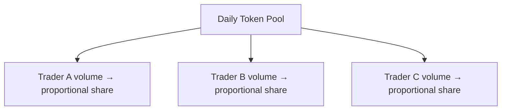

# Token Incentives Guide

Volume-based token reward system for traders on the Pump platform.

## Overview

The token incentives system rewards traders based on their SOL trading volume. Rewards are distributed daily from a configurable token supply pool. The system tracks volume across both the Pump bonding curve program and the PumpAMM program.

## How It Works



1. A global daily token pool is configured (e.g., 1M tokens/day)
2. Each trader's SOL volume is tracked via a `UserVolumeAccumulator`
3. Rewards are proportional: `(userVolume / totalVolume) × dailyTokenPool`
4. Unclaimed rewards accumulate across days

## Setup for Users

### Initialize Volume Tracking

Before a user can earn incentives, they need a volume accumulator account:

```typescript
import { PUMP_SDK, OnlinePumpSdk } from "@pump-fun/pump-sdk";

const connection = new Connection("https://api.devnet.solana.com", "confirmed");
const sdk = new OnlinePumpSdk(connection);

// Initialize (one-time setup)
const ix = await PUMP_SDK.initUserVolumeAccumulator({
  payer: wallet.publicKey,
  user: wallet.publicKey,
});
```

### Check Rewards

```typescript
// Unclaimed rewards from pump program only
const pumpRewards = await sdk.getTotalUnclaimedTokens(user);

// Combined rewards from both programs
const totalRewards = await sdk.getTotalUnclaimedTokensBothPrograms(user);

// Current day's accrued rewards
const todayRewards = await sdk.getCurrentDayTokensBothPrograms(user);

console.log("Total unclaimed:", totalRewards.toString());
console.log("Today's rewards:", todayRewards.toString());
```

### Claim Rewards

```typescript
// Claim from both programs
const instructions = await sdk.claimTokenIncentivesBothPrograms(user, payer);

const tx = new Transaction().add(...instructions);
await sendAndConfirmTransaction(connection, tx, [wallet]);
```

### Sync Volume Data

If volume data is stale, sync it:

```typescript
// Sync across both programs
const ixs = await sdk.syncUserVolumeAccumulatorBothPrograms(user);
```

### Close Volume Tracking

To reclaim rent:

```typescript
const ix = await PUMP_SDK.closeUserVolumeAccumulator(user);
```

## Pure Math Functions

For offline reward calculations without network calls:

```typescript
import {
  totalUnclaimedTokens,
  currentDayTokens,
} from "@pump-fun/pump-sdk";

// Calculate unclaimed tokens from raw accumulator data
const unclaimed = totalUnclaimedTokens(
  globalVolumeAccumulator,
  userVolumeAccumulator,
  Math.floor(Date.now() / 1000),  // optional timestamp
);

// Calculate current day's earnings
const today = currentDayTokens(
  globalVolumeAccumulator,
  userVolumeAccumulator,
);
```

## On-Chain Account Types

### `GlobalVolumeAccumulator`

Tracks the total trading volume and token supply allocation per day.

```typescript
interface GlobalVolumeAccumulator {
  startTime: BN;           // Program start timestamp
  endTime: BN;             // Program end timestamp
  secondsInADay: BN;       // Day duration for bucket calculation
  mint: PublicKey;          // Reward token mint
  totalTokenSupply: BN[];  // Token supply per day bucket
  solVolumes: BN[];        // Total SOL volume per day bucket
}
```

### `UserVolumeAccumulator`

Tracks an individual user's trading volume and claim state.

```typescript
interface UserVolumeAccumulator {
  user: PublicKey;
  needsClaim: boolean;          // Whether a claim is pending
  totalUnclaimedTokens: BN;    // Accumulated unclaimed rewards
  totalClaimedTokens: BN;      // Total claimed to date
  currentSolVolume: BN;        // Volume in current day bucket
  lastUpdateTimestamp: BN;     // Last sync timestamp
}
```

### `UserVolumeAccumulatorTotalStats`

Combined stats from both programs (returned by `fetchUserVolumeAccumulatorTotalStats`).

```typescript
interface UserVolumeAccumulatorTotalStats {
  totalUnclaimedTokens: BN;
  totalClaimedTokens: BN;
  currentSolVolume: BN;
}
```

## Admin Functions

These are restricted to program administrators:

```typescript
// Configure incentives for pump program
const ix = await sdk.adminUpdateTokenIncentives(
  startTime,          // BN - program start
  endTime,            // BN - program end
  dayNumber,          // number - which day to configure
  tokenSupplyPerDay,  // BN - tokens allocated for that day
  secondsInADay?,     // BN - optional, defaults to 86400
  mint?,              // PublicKey - reward token
  tokenProgram?,      // PublicKey - Token program ID
);

// Configure for both programs at once
const ixs = await sdk.adminUpdateTokenIncentivesBothPrograms(
  startTime, endTime, dayNumber, tokenSupplyPerDay,
  secondsInADay?, mint?, tokenProgram?,
);
```

